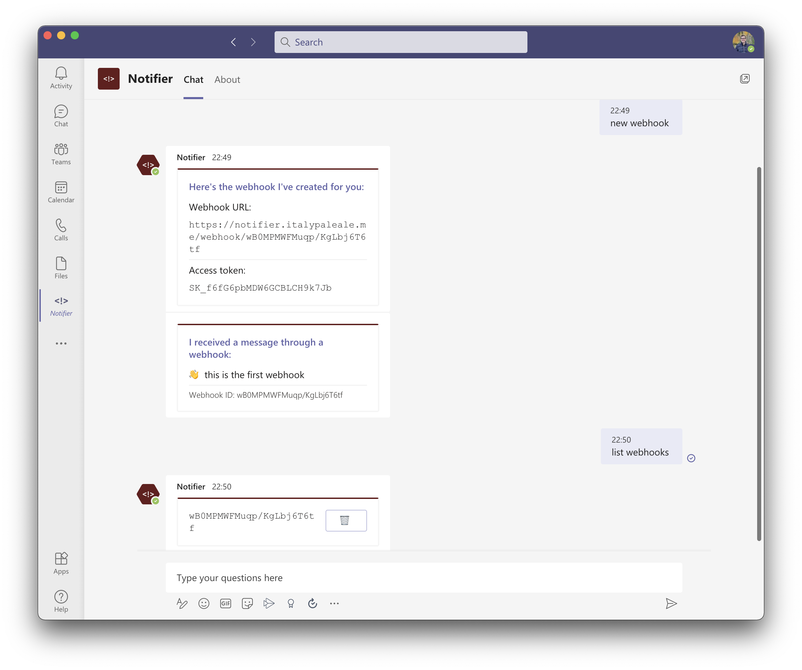

# Notify-bot for Teams

This is a bot for Microsoft Teams that allows you receive alerts via webhooks. You can add it to a conversation or a team and it will generate a new webhook endpoint that forwards messages to that.



This bot is meant to be deployed on Cloudflare Workers, and it stores data on Workers KV. It is compliant with the [HTTP 1.1 Web Hooks for Event Delivery - Version 1.0.1](https://github.com/cloudevents/spec/blob/v1.0.1/http-webhook.md) spec.

## Try it live

Try the app in Microsoft Teams yourself.

### Install the app

Because I cannot distribute this publicly on the Teams store, you'll have to either sideload (upload) the app or publish it for users of your org.

1. [Download the app bundle from this repo](./resources/notifier.zip). This is a ZIP file containing the app's manifest and icons.
2. Please refer to the official documentation on how to install the app using the ZIP file you downloaded:
   - [Uploading the app for you](https://docs.microsoft.com/en-us/microsoftteams/platform/concepts/deploy-and-publish/apps-upload#upload-your-app)
   - [Publish for your org](https://docs.microsoft.com/en-us/MicrosoftTeams/manage-apps)

### Add the bot

You can add the bot to a 1:1 conversation, a group chat, or a team/channel.

In group chats and channels, you can communicate with the bot by @'ing it before the messages, such as `@Notifier command`.

### Create a new webhook

To create a new webhook, send the bot the `new webhook` message (in group chats or channels, make sure to @ the bot).

The bot will respond with a URL for your webhook (such as `https://notifier.italypaleale.me/webhook/wB0MPMWFMuqp/KgLbj6T6tf`) and an access token (a secret key, such as `SK_f6fG6pbMDW6GCBLCH9k7Jb`).

Each conversation can have up to 5 webhooks. Also note that it may take up to 1 minute for all webhooks to be replicated across all deployments via Cloudflare KV.

### Invoke the webhook

To invoke the webhook, make a POST request to the URL for your conversation. There are two ways to send a message:

- If the request's `Content-Type` header is `text/plain`, the entire body of the request is considered to be the message to be sent, as-is
- You can also encode your message as JSON and use the `application/json` content type. The body should be a JSON-encoded objet containing the `message` key with your message; all other keys are ignored.

Pass the access token as value for the **`Authorization`** header (another option, not recommended, is to append it to the URL as a querystring parameter `access_token`).

For example, with curl:

```sh
# JSON-encoded message
curl \
  --header "Content-Type: application/json" \
  --header "Authorization: SK_f6fG6pbMDW6GCBLCH9k7Jb" \
  --data '{"message":"👋 hi there!"}' \
  https://notifier.italypaleale.me/webhook/wB0MPMWFMuqp/KgLbj6T6tf

# Plain-text message
curl \
  --header "Content-Type: text/plain" \
  --header "Authorization: SK_f6fG6pbMDW6GCBLCH9k7Jb" \
  --data 'Sending a message 💬' \
  https://notifier.italypaleale.me/webhook/wB0MPMWFMuqp/KgLbj6T6tf
```

## Development guide

The steps below are for users who want to run their own bot based on this code.

### Environments

There are 3 environments for this bot:

- local: designed for running locally via `wrangler dev`  
  (worker name: `notify-cfbot-local`)
- dev: deployed to `https://notify-cfbot.italypaleale.workers.dev`  
  (worker name: `notify-cfbot`)
- production: deployed to `https://notifier.italypaleale.me`
  (worker name: `notify-cfbot-production`)

### Test with the Bot Framework Emulator

```sh
# Set CF_ACCOUNT_ID to your Cloudflare Account ID
export CF_ACCOUNT_ID=..
wrangler dev --env local
```

Note: to be able to communicate with the [Bot Framework Emulator](https://docs.microsoft.com/en-us/azure/bot-service/bot-service-debug-emulator), you may need to create a tunnel with ngrok on the port the Bot Emulator is listening to first:

```sh
# Set the port to the one Bot Framework Emulator is listening to
ngrok http :49482
```

Then start wrangler with:

```sh
# Set the URL of the ngrok endpoint
export SERVICE_URL_OVERRIDE=https://****.ngrok.io
# Set CF_ACCOUNT_ID to your Cloudflare Account ID
export CF_ACCOUNT_ID=..
wrangler dev --env local
```

This is because the Bot Framework Emulator is running on localhost, whereas the dev environment for Workers runs on the Cloudflare infrastructure, so localhost is not available there.

### Create KV namespaces

Create for the 3 environments and the preview space:

```sh
# Set CF_ACCOUNT_ID to your Cloudflare Account ID
export CF_ACCOUNT_ID=..
KV_NAME="notifycfbot_webhooks"
wrangler kv:namespace create "${KV_NAME}_preview"
wrangler kv:namespace create "${KV_NAME}_dev"
wrangler kv:namespace create "${KV_NAME}_production"
```

The IDs are used in the `wrangler.toml` file:

- The ID of the `preview` KV is used in all environments for the `preview_id` key
- The ID of the `dev` KV is used in the main environment (the unnamed one)
- The ID of the `production` KV is used in the production environment
- The ID of the `preview` KV is also used in the local environment

### Set secrets

```sh
# Set CF_ACCOUNT_ID to your Cloudflare Account ID
export CF_ACCOUNT_ID=..
# For dev
wrangler secret put TEAMS_APP_PASSWORD
wrangler secret put TEAMS_APP_PASSWORD --env local
wrangler secret put TEAMS_APP_PASSWORD --env production
```

### Bot setup

If you need to set up the bot in Teams App Studio, make sure to:

- Create a new application for this bot with all scopes enabled (personal, team, group chat); leave all other options disabled (bot doesn't support audio/video calls, doesn't support uploading or downloading files, and is not a one-way notification bot)
- The bot application id is the value for the `TEAMS_APP_ID` variable in `wrangler.toml`
- Set the messaging endpoint to `https://<host>/bot/v0/message` (replace `<host>` with the host where your bot is deployed to)
- Generate a new password for the bot, which will be used for the `TEAMS_APP_PASSWORD` secret stored alongside the Worker

Then add the following commands:

- Command text: `new webhook`  
  Help text: `Create a new webhook for this conversation/channel`  
  Select all scopes
- Command text: `list webhooks`  
  Help text: `List webhooks for this conversation/channel`  
  Select all scopes

### Base URL

In the `wrangler.toml` file, make sure to set the value of `BASE_URL` for all environments. This is only used to show the user the full endpoint of their webhooks.
